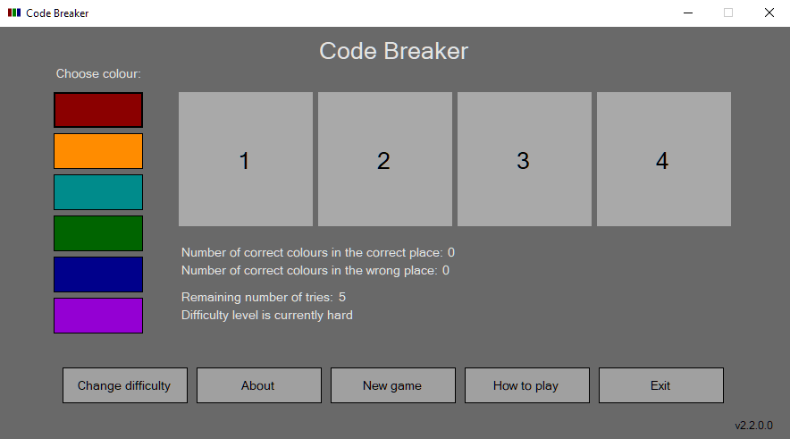

# Code Breaker

Guess the correct code / colour combination!

This was a test for a possible puzzle to be included in another game but has since evolved into its own little game.

In version 1.x.x.x there are three colours in the combination and in version 2.x.x.x there are four. The difficulty is the same so this makes version 2 slightly more difficult.

Here is how to play:

The player tries to guess the pattern, in both order and colour, within the turns allowed by the difficulty level.

When the player finishes one turn, the computer provides feedback by telling the player how many of the colours are correct but in the wrong position and how many colours are correct and in the correct position.

If the player guesses the correct colours in the correct order the player wins, if not the game advances to the next turn or ends if there are no more turns.

Developed with Visual Studio 2022
